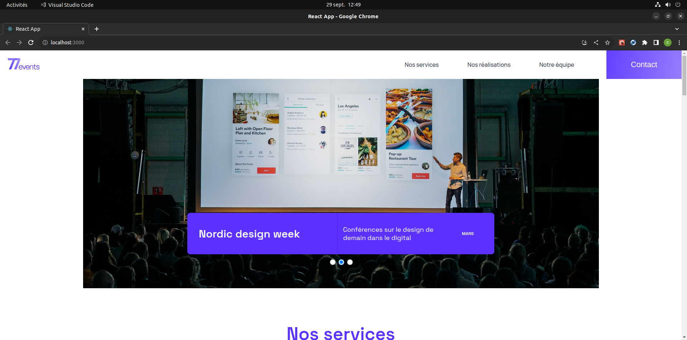

# Débuggez le site d'une agence d'événementiel

Dixième projet du parcours "D'intégrateur web" chez OpenClassroom. L'objectif est de débuggez le site de l’agence évènementielle 724events.

Vous pouvez retrouver le repo github d'origine [ici](https://github.com/OpenClassrooms-Student-Center/Debuggez-une-application-React.JS).

_Voici une capture d'écran du résultat de ma réalisation_



## Objectifs

Étant développeur freelance, j'ai été contacté par Jean-Batiste, le directeur marketing de l’agence qui souhaite publier la nouvelle version de son site vitrine. Il s’agit d’un site one-page.

Le design a été validé, et un premier développeur freelance avait commencé l’intégration il y a quelques semaines. Malheureusement, ce freelance a dû abandonner le projet pour raisons personnelles. Le site est fonctionnel, mais quelques bugs entravent le bon usage par les visiteurs. 724events fait donc appel à vous pour finaliser le travail.

## Ma tache

Le précédent développeur freelance à intégrer à l'application des tests unitaire par Jest pour l'aider dans sa tâche. L’application est donc testée en grande partie :

- les composants sont testés (test unitaire) ;
- le code est entièrement testé.

Mais des bugs reste présent et voici ceux qui ont déjà été répertorier :

- Le carrousel affiche les évènements par ordre aléatoire alors qu'il devrait les afficher par date en ordre décroissant.
- Le carrousel affiche une page blanche à la fin de ce dernier.
- Le filtre pour la section "Nos réalisations" ne fonctionne pas. Il faut que les réalisations soient filtrables et affichent les bons mois.
- Le formulaire s’envoie, mais le message de confirmation ne s’affiche pas.
- La dernière prestation d'évènement de l'agence ne s'affiche pas dans la vignette du footer.

Il faudra rechercher d'éventuelle autres bug et les fixer en fonction du besoin de Jean-Baptiste. Certains sont détectables via les tests. Possibilité de trouver les bugs grâce aux tests invalides.

Tous les voyants de tests doivent passer au vert une fois les bugs résolus.

## Livrables

### Débuggage

**1er étape**

- **Lister les bugs supplémentaire donner par la console du navigateur**
- **Lister ceux signaler par les tests unitaires**
- **Lister les bugs visuels et de fonctionnements**

**2e étape**

- **Résoudre les bugs signaler par la console du navigateur (ce qui peut résoudre, en partie, les bugs de certains test unitaire)**
- **Résoudre les bugs qui sont déjà répertorier**
- **Résoudre les bugs des test unitaires restant (s'il en reste)**
- **Résoudre les bugs visuels et de fonctionnements restants**

**3eme étapes**

- **Relancer un test unitaire complet et vérifier que tous soient bien vert**
- **Remplir le cahier de recette**

## Technologies

**Autorisés:** Tout

**Recommandée:** React Developer Tools et tous ce qu'il sera utile pour la résolution des bugs

**Interdit:** Rien

## Notes

**Contraintes :**

- Maquette desktop : non
- Maquette Mobile : non
- Test unitaire : Tous les voyants de tests doivent passer au vert une fois les bugs résolus.
- Compatibilité : Dernières versions de Chrome, Firefox & Safari.
- Général : Le code ne doit pas produire d'erreur ou de warning dans la console.

## Convention nommage commit

Gitmoji https://gitmoji.dev/

## Tester le projet

Pour tester simplement & rapidement, je vous invite à cloner le project.

clonez le projet :

```terminal
git clone https://github.com/Aeron01/OC-Projet-10-Debuggage-d_une_api_React.git
```

## Pre-requis

- NodeJS >= v16.14.1

## Installation

- `yarn install`

## Lancement de l'application

- `yarn start`

## Tests

- `yarn test`
